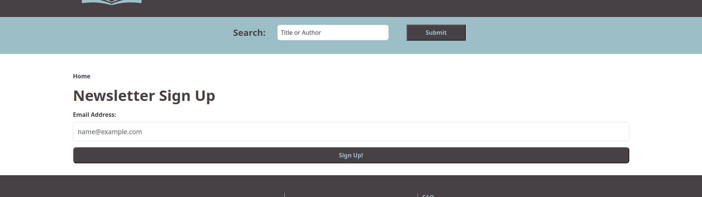
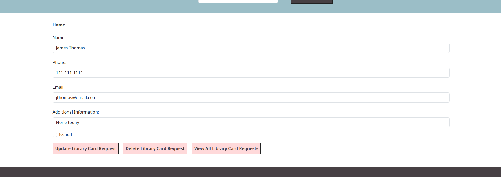
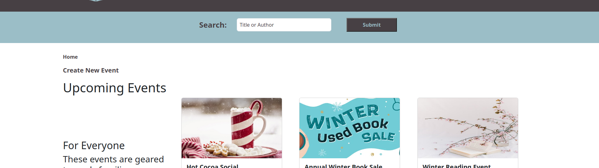

<a name="readme-top"></a>

<br />
<div align="center">
  
<h3 align="center">Public Library Demo Website</h3>

  <p align="center">
    Full Stack MERN (MongoDB, Express, React, and Node) Project
    <br />
    <a href="https://anotherpagelibrary.netlify.app/" target="_blank">View Demo</a>
    ·
    <a href="https://github.com/Amiriel01/Public-Library-Website/issues">Report Bug</a>
    ·
    <a href="https://github.com/Amiriel01/Public-Library-Website/issues">Suggestions</a>
  </p>
</div>

<details>
  <summary>Table of Contents</summary>
  <ol>
    <li>
      <a href="#about-the-project">About The Project</a>
      <ul>
        <li><a href="#user-view-website-features">User View Website Features</a></li>
      </ul>
      <ul>
        <li><a href="#admin-view-website-features">Admin View Website Features</a></li>
      </ul>
      <ul>
        <li><a href="#built-with">Built With</a></li>
      </ul>
    </li>
    <li>
      <a href="#getting-started">Getting Started</a>
      <ul>
        <li><a href="#installation">Installation</a></li>
      </ul>
    </li>
    <li><a href="#contributing">Contributing</a></li>
    <li><a href="#acknowledgments">Acknowledgments</a></li>
  </ol>
</details>

## About The Project

I wanted to create a full stack public library website that I could use as a demo in my portfolio. The website has a responsive design that works great on mobile and in website viewing. My local library is wonderful and I'm an avid reader, both the place and my reading hobby provided inspiration for the website theme idea. I thought it would be a great project that I would really enjoy creating, and I was correct!

I learned a lot while working on this project and also practiced many skills I already had. I hope you enjoy viewing this project as much as I enjoyed creating it. Below you will see several images and descriptions, you can also view the live demo by clicking the link above in the header. 

If you notice any bugs or have an idea to make this website even better please use the links above to make your suggestions! Thank you in advance for viewing my website. 

### User View Website Features

**First Header Section**

The first header, which can be seen at the top of every page in the project features the library logo and name, along with three buttons for navigating to important pages in the website. Clicking the logo in the header will always return the user to the Homepage. 


**FAQs Page**

The Frequently Asked Questions page has five sections. Each section has an accordion that drops down when clicked. 

***Library Card FAQs***

The Library Card FAQ section has eight topics. Each topic provides information, with one topic linking to an additional page.


The "How do I apply for a library card?" section has a link to the library card application and some library card information.


The library card application form takes a users information and PUTs it in the database. The user will enter their name, phone number, email, and additional comments if needed. Once the user submits the information they will recieve an alert letting them know it has been successfully submitted.


***Borrowing Services FAQs***

The Borrowing Services FAQ section has five topics. Each topic provides information, with one topic linking to an additional page.


The "Cross Library Loans" section has a link to the cross library loans form and provides cross library loan information.


The cross library loan form takes a users information and PUTs it in the database. The user will enter the title, author, material type (from a select menu), name, library card number, phone number, and email address. Once the user submits the information they will recieve an alert letting them know it has been successfully submitted.


***Technology Services FAQs***

The technology services section has six informtaional sections in the accordion dropdown menu. 


***Giving FAQs***

The Giving FAQ section has three topics. Each topic provides information, with two topics linking to an additional page.


The "Monatary Donations" section has a link to the Giving page. The Giving page has information and another accordion with monatary donations faqs.


The "Ways to Give" FAQ accordion has five topics. Two of the topics, the "Give Now" and "Make a Monthly Gift" sections have a button to route to the donations page. Donations are not set up, because this is a demo site, and users will be routed to a page that tells them this. The other three sections also give information to the user.


The Giving FAQ Volunteer section gives information and links to the Volunteer form page. The volunteer form PUTs the information in the database for later use. The volunteer form has inputs, a select, and checkboxes for the user to use when completing the form. The user is alerted when their form is submitted successfully.


***Meeting and Study Rooms FAQ***

The Meeting and Study Rooms FAQ section has five topics. The "What meeting rooms are available?" section gives information and also routes to another page where users can see images and possible layout suggestions for the rooms. The "What study rooms are available?" section shows images and gives descriptions of the study rooms. The other three topics give information to the user. (Second image zoomed to show the whole page in one screenshot)


**Contact Us Page**

The contact us button is located in the first header. When the user clicks the button they are routed to a new page. The new page features library department phone numbers, head librarians for each department, and a contact form that PUTs the users contact request in the database for later viewing. The user is also alerted on the page when their contact request form is submitted successfully.


**Hours and Location Page**

The hours and location button is located in the first header. When the user clicks the button they are routed to a new page. The new page that gives information about the library hours, location, and main phone number. The page also has a button that will link to the contact page if the user needs additional information from the library.


**Second Header Section**

The second header is also seen at the top of every page in the project. Users are able to search by book, author, or genre to find a list of the top 10 results given by the Google Books API. 


Once a search has been made, the user is routed to the search results page. They will be able to view the result details. I am showing an image with the first 2 results, all 10 results in the list have the same details shown. Users will see the book cover, title, author, description, and be able to click the link to view the Google Books profile of the book. 


**Homepage Image Slider**

The homepage image slider has four images that link to events happening at the library. The first image, when clicked, routes to a page that shows multiple author events that will be happening at the library. The second, routes to a reading to resues event for teens and tweens. The final two images do not route to different pages and are there to remind users of an upcoming sweater drive and book sale.

***Author Event Section***


The Author Event page that is routed to has four upcoming author events on it. Users will see the author image, name, time, date, description, and link to an outside website about the author on each author's event section. The image provided shows two of the author events, the other two follow the same format.


***Reading to Rescues Section***


The Reading to Resues event image on the carousel links to the event details page for the Reading to Rescues event. The event page shows the same image from the carousel slightly modified, the date, time, event type, age group for the event, and the event description. The event and image path are saved in a MongoDB database. All event pages use the same template and an API call on the event ID to populate the page. 


***Sweather and Book Sale Images***


**Traveling Exhibit**

The traveling exhibit section showcases the current exhibit on display at the library. The exhibit has two images and a description for the event.


**Square Buttons**

The homepage has four square button, each link has an icon. The links route the user to the page specified. 


The About the Library square button routes to a page that gives facts about the library and images. 


The Upcoming Events square button routes to another page that shows the four age group categories for events and GETs the event information from the database. Each event section is in its own component and imported to the upcoming events page. 

.


Each event has a button that GETs that specific event details from the database and routes the user to the event page for the event on click.


The Give to Library square button links to the same Giving page that is linked in the FAQs section.

The Student Resources square button links the to student resources page. This page has three sections, each section is its own component. The Math and Reading resources sections offer links to outside helpful resources that students can use for free.


**Newsletter Sign Up (First Footer)**

All pages, except the newsletter sign up form page, have the Newsletter Sign Up footer. Users click the Sign Up Now button and are routed to the Newsletter Sign Up form page. Users will enter their email and be notified that they have successfully signed up using an alert.




**Second Footer**

The second footer had the logo and library name, this footer will route user to the homepage like in the header. It also has a social media section that is not linked because this is a fictional library. If the library was a real business this is the section where social media links would be found. The last section of the second footer links to important pages and also has the admin library login link.


<p align="right">(<a href="#readme-top">back to top</a>)</p>

### Admin View Website Features

After clicking the Library Login link in the second footer users are routed to the admin login form. Once the admin user has logged in they will see new features that the user view did not show.


When the library admin user is logged in the second footer will show Library Logout as the new link option. When this link is clicked the admin is logged out and the user view is shown again.


***Admin Contact***

The admin contact page now shows a link to view all contact requests. Clicking this link GETs all of the contact requests in the database. The requests are filtered into two categories, completed and not completed. Each contact request card shows the user's name, phone number, email, question they selected, message user sent, and a place for admin notes. 


When the admin clicks on a contact request they are routed to the contact request details page. The API call GETs the details from the database and displays them in a template used for all contact requests. Once on the contact details page the admin will see the information from the previous page that cannot be changed, a checkbox to mark the contact request completed, and a place to enter admin notes if needed. The admin will also see three button options, Update Contact Request, Delete Contact Request, and View All Contact Requests. Clicking the update and delete buttons will PUT and DELETE from the database. Clicking the buttons will route the admin user back to the view all contact requests page. 


***Admin Library Card Application***

When the admin clicks the Library Card Application link in the FAQs section they are routed to the application form page and will see an additional link. This link will route the admin to a page where they can view all library card applications via a GET API call. All library cards are filtered and sorted into the categories, issued and not issued.


When the admin user clicks on a library card request they are routed to the library card details page. The admin is able to update all information on this page so they are able to update user information in the event information changes. The admin has a checkbox to check when the card has been issued and a space for providing additional information if needed. The admin will also see three button options, Update Contact Request, Delete Contact Request, and View All Contact Requests. Clicking the update and delete buttons will PUT and DELETE from the database. Clicking the buttons will route the admin user back to the view all library card requests page. 



***Admin Cross Library Form***

When the admin clicks Cross Library link in the FAQs section they are routed to the application form page and will see an additional link. This link will route the admin to a page where they can view all cross library forms via a GET API call. All library cards are filtered and sorted into the categories ordered and not ordered.


When the admin user clicks on a contact request they are routed to the contract request details page. The admin is able to see the information from the all contact requests page on this page. The admin has a checkbox to check when the item has been ordered and a space for providing order notes if needed. The admin will also see three button options, Update Cross Library Loan Request, Delete Cross Library Loan Request, and View All Cross Library Loan Requests. Clicking the update and delete buttons will PUT and DELETE from the database. Clicking the buttons will route the admin user back to the view all cross library loan requests page. 


***Admin Volunteer Application***

When the admin clicks the Volunteer Application link in the FAQs section they are routed to the application form page and will see an additional link. This link will route the admin to a page where they can view all volunteer applications via a GET API call. All volunteer applications are filtered and sorted into the categories, new applications and approved applications.


When the admin user clicks on a volunteer application they are routed to the volunteer application details page. The admin is able to view all information on this page about the volunteer application. The admin has a checkbox to check when the application has been approved and a space for providing interview notes if needed. The admin will also see three button options, Update Volunteer Applictation, Delete Volunteer Application, and View All Volunteer Applications. Clicking the update and delete buttons will PUT and DELETE from the database. Clicking the buttons will route the admin user back to the view all library card requests page. 


***Create Events***

The admin user can create new events when they are logged in. To access the form to add events the admin user will click on the Create New Event link on the Upcoming Events page. Once the admin user clicks this link they will be routed to a form to create the event. The admin user will select the image file by clicking Choose File and then Select Image after selecting the image file. The admin user will then complete the form and hit Submit New Event.




<p align="right">(<a href="#readme-top">back to top</a>)</p>

### Built With

* [![Node][Node.js]][Node-url]
* [![React][React.js]][React-url]
* 
* [![React-Router][React-Router.com]][React-Router-url]
* [![Vite][vite.js]][Vite-url]
* [![Bootstrap][Bootstrap.com]][Bootstrap-url]
* 
* [![TypeScript][TypeScript.com]][TypeScript-url]
* [![Express][Express.js]][Express-url]
* [![MongoDB][MongoDB.com]][MongoDB-url]
* [![Nodemon][Nodemon.io]][Nodemon-url]
* [![NPM][NPM.io]][NPM-url]
* [![VSCode][VSCode.com]][VSCode-url]

<p align="right">(<a href="#readme-top">back to top</a>)</p>

## Getting Started

To get a local copy up and running follow these simple example steps.

### Installation

1. Get a free API Key at [Google Books API](https://developers.google.com/books)
2. Clone the repo
   ```sh
   git clone https://github.com/Amiriel01/Public-Library-Website
   ```
3. Install NPM packages
   ```sh
   npm install
   ```
4. Enter your API in `app.ts`
   ```js
   const API_KEY = 'ENTER YOUR API';
   ```
5. Connect you MongoDB database `app.ts`

<p align="right">(<a href="#readme-top">back to top</a>)</p>

## Contributing

Contributions are what make the open source community such an amazing place to learn, inspire, and create. Any contributions you make are **greatly appreciated**.

If you have a suggestion that would make this better, please fork the repo and create a pull request. You can also simply open an issue with the tag "enhancement".
Don't forget to give the project a star! Thanks again!

1. Fork the Project
2. Create your Feature Branch (`git checkout -b feature/AmazingFeature`)
3. Commit your Changes (`git commit -m 'Add some AmazingFeature'`)
4. Push to the Branch (`git push origin feature/AmazingFeature`)
5. Open a Pull Request

<p align="right">(<a href="#readme-top">back to top</a>)</p>


## Acknowledgments

* [Pexels: Website Images](https://www.pexels.com/)
* [Pixaby: Website Images](https://pixabay.com/)
* [This Person Does Not Exist: Staff Images](thispersondoesnotexist.com)
* [Google Books API](https://developers.google.com/books)
* [App Logo: Library Logo](app.logo.com)
* [Google Icons](https://fonts.google.com/icons)
* [Devicon](https://devicon.dev/)

<p align="right">(<a href="#readme-top">back to top</a>)</p>

[Node.js]: https://img.shields.io/badge/node.js-6DA55F?style=for-the-badge&logo=node.js&logoColor=white
[Node-url]: https://nodejs.org/en
[React.js]: https://img.shields.io/badge/React-%2320232a?style=for-the-badge&logo=react&logoColor=%2361DAFB
[React-url]: https://reactjs.org/
[React-Router.com]: https://img.shields.io/badge/React_Router-CA4245?style=for-the-badge&logo=react-router&logoColor=white
[React-Router-url]: https://reactrouter.com/en/main
[Vite.js]: https://img.shields.io/badge/vite-%23646CFF.svg?style=for-the-badge&logo=vite&logoColor=white
[Vite-url]: https://vitejs.dev/
[Bootstrap.com]: https://img.shields.io/badge/Bootstrap-%238511FA?style=for-the-badge&logo=bootstrap&logoColor=white
[Bootstrap-url]: https://getbootstrap.com
[TypeScript.com]: https://img.shields.io/badge/typescript-%23007ACC.svg?style=for-the-badge&logo=typescript&logoColor=white
[TypeScript-url]: https://www.typescriptlang.org/
[Express.js]: https://img.shields.io/badge/express.js-%23404d59.svg?style=for-the-badge&logo=express&logoColor=%2361DAFB
[Express-url]: https://expressjs.com/
[MongoDB.com]: https://img.shields.io/badge/MongoDB-%234ea94b.svg?style=for-the-badge&logo=mongodb&logoColor=white
[MongoDB-url]: https://www.mongodb.com/
[Nodemon.io]: https://img.shields.io/badge/NODEMON-%23323330.svg?style=for-the-badge&logo=nodemon&logoColor=%BBDEAD
[Nodemon-url]: https://nodemon.io/
[NPM.io]: https://img.shields.io/badge/NPM-%23CB3837.svg?style=for-the-badge&logo=npm&logoColor=white
[NPM-url]: https://www.npmjs.com/
[VSCode.com]: https://img.shields.io/badge/Visual%20Studio-5C2D91.svg?style=for-the-badge&logo=visual-studio&logoColor=white
[VSCode-url]: https://code.visualstudio.com/


